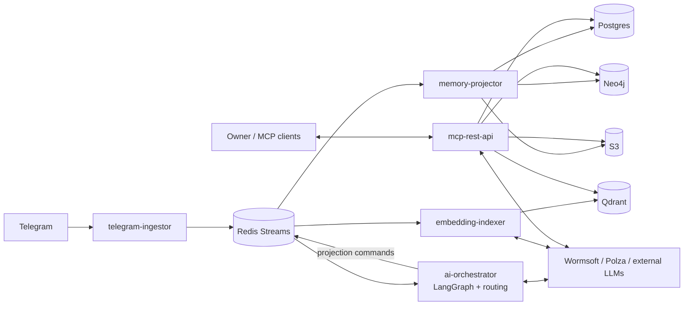

# Большая картина

Один экран, чтобы быстро понять, чем PIL стал **в финальной AI-архитектуре**, а не только в исходном broad vision.

> Актуализация на 2026-05-13.
> [Исполнительное резюме](../Исполнительное%20резюме.md) — стратегический документ.
> Каноническая implementation-модель описана в [ai-integrated-architecture.md](../02-architecture/ai-integrated-architecture.md).

## Что такое PIL теперь

PIL — это self-hosted memory layer над Telegram, который:

- забирает сообщения только из разрешённых чатов;
- превращает поток сообщений в структурированную память;
- хранит канон в Postgres и retrieval-проекции в Neo4j/Qdrant/S3;
- отдаёт grounded context внешним LLM через MCP/REST.

Ключевое изменение относительно ранних планов: теперь центр системы — не набор слабо связанных extractor'ов, а **единый AI orchestration layer** с task-based routing и управляемой работой с внешними моделями.

## Контур системы

## Как это работает

1. `telegram-ingestor` нормализует Telegram updates и публикует события в Redis Streams.
2. `ai-orchestrator` собирает message/window context, выбирает policy и модели, затем извлекает факты, задачи, summaries и persona updates в виде structured outputs.
3. `memory-projector` детерминированно применяет эти результаты в Postgres, Neo4j и S3.
4. `embedding-indexer` считает embeddings через Wormsoft или Polza и индексирует память в Qdrant.
5. `mcp-rest-api` собирает grounded context из SQL + vector + graph и, при необходимости, делает короткий synthesis.

## Почему это лучше исходного плана

- LLM-поведение централизовано и наблюдаемо.
- Структурированные extraction-задачи перестают быть размазаны по разным сервисам.
- Routing, quota, fallback и budgets можно контролировать как отдельный слой.
- Retrieval становится grounded-first, а не "агент сначала думает, потом ищет".

## Что остаётся важным из исходного vision

- privacy by default;
- self-host;
- event-driven core;
- polyglot storage;
- совместимость с внешними LLM через MCP.

## Где смотреть детали

- [ai-integrated-architecture.md](../02-architecture/ai-integrated-architecture.md)
- [system-overview.md](../02-architecture/system-overview.md)
- [components.md](../02-architecture/components.md)
- [data-flow.md](../02-architecture/data-flow.md)
