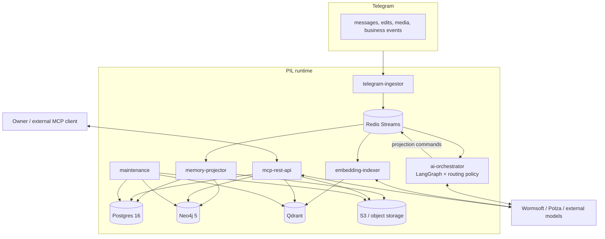
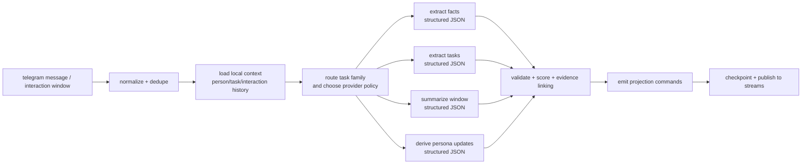

# AI-Integrated Architecture

> Каноническая целевая архитектура на 2026-05-13.
> [Исполнительное резюме](../Исполнительное%20резюме.md) остаётся стратегическим vision-документом.
> Этот файл описывает именно **целевую implementable-модель** для PIL.

## Зачем нужен архитектурный reset

Текущий runtime уже доказал базовую жизнеспособность PIL:

- ingestion из Telegram работает;
- event-driven контур на Redis Streams работает;
- Postgres, Qdrant, Neo4j и S3 уже включены в стек;
- первые processing-сервисы уже живут на сервере.

Но текущая структура выросла из изначального broad plan и пока не даёт цельного AI-контура. Сейчас LLM используется только точечно, а extraction/summarization логика размазана по нескольким сервисам. Новая архитектура должна собрать это в управляемый слой с:

- понятной оркестрацией;
- task-based routing по моделям;
- строгими structured outputs;
- наблюдаемостью и cost control;
- безопасной интеграцией внешних моделей.

## Основные принципы

1. **LLM не пишет в базу напрямую.**
   LLM формирует только структурированные решения и projection commands.

2. **LangGraph используется там, где нужен stateful workflow.**
   Для one-shot вызовов и простых deterministic шагов обычный Python-код проще и надёжнее.

3. **Structured output обязателен.**
   Все extraction/summarization результаты проходят через Pydantic-схемы и явную валидацию.

4. **Postgres остаётся каноническим источником правды.**
   Neo4j, Qdrant и S3 считаются производными проекциями.

5. **Routing идёт по семействам задач, а не "одна модель на всё".**
   Отдельно маршрутизируются extraction, summarization, synthesis и embeddings.

6. **Для embeddings активен только один профиль за раз.**
   Multi-provider embeddings допустимы только при гарантированной совместимости dimension/profile/version.

7. **Owner identity отделяется от contact memory.**
   Владелец инстанса не моделируется как ordinary external person. Его сообщения и устойчивые настройки образуют first-party context layer, который влияет на анализ людей, чатов, задач и retrieval.

8. **Owner context обновляется по meaningful-change модели.**
   First-party профиль не должен переписываться на каждое сообщение в hot path. Быстрый контекст живёт на уровне окна/диалога, а стабильный owner profile обновляется через consolidation.

## Целевая структура сервисов

| Сервис | Роль | Использует LLM |
|---|---|---|
| `telegram-ingestor` | Telegram ingestion, media upload, raw event publishing | нет |
| `ai-orchestrator` | Stateful анализ сообщений и окон диалогов, LangGraph workflow | да |
| `memory-projector` | Детерминированное применение projection commands в Postgres/Neo4j/S3 | нет |
| `embedding-indexer` | Подсчёт dense embeddings и upsert в Qdrant | да |
| `mcp-rest-api` | MCP + REST retrieval layer, optional grounded synthesis | да |
| `maintenance` | Retention, partitions, reindex jobs, background housekeeping | нет |
| `xray` | Proxy/network support для Telegram и внешних API | нет |

### Что это меняет относительно текущего runtime

Текущие `entity-extractor`, `persona-builder`, `task-extractor`, `chat-summarizer` считаются **переходным слоем**, который постепенно должен быть схлопнут в:

- `ai-orchestrator`
- `memory-projector`
- `embedding-indexer`

Это уменьшает дублирование prompt-логики, убирает рассинхрон правил между сервисами и делает LLM behavior управляемым в одном месте.

## Контейнерная картина

## Внутреннее устройство `ai-orchestrator`

`ai-orchestrator` должен быть единственной точкой, где живёт сложная LLM-оркестрация. Это как раз тот случай, где LangGraph оправдан: нужны state, checkpoints, branching и controlled side effects.

### Где нужен LangGraph

- группировка и повторный анализ conversation windows;
- checkpointing долгих workflow;
- conditional branching по типу сообщений и confidence;
- controlled re-run/backfill;
- human interrupt для admin-triggered reprocess, destructive reindex или debug workflows.

### Где LangGraph не нужен

- ingestion;
- чистые SQL/Cypher upsert;
- embeddings upsert;
- простые health/maintenance jobs;
- retrieval composition в API, если там нет многошагового agent flow.

## Task-family routing

PIL должен использовать routing не "по сервису", а по **семейству AI-задач**.

| Family | Примеры задач | Primary | Fallback | Особенности |
|---|---|---|---|---|
| `extract_structured` | entities, facts, commitments, relationship hints | Wormsoft | Polza | строгий JSON/Pydantic output |
| `summarize_window` | interaction summaries, topic rollups | Wormsoft | Polza | допускается более длинный context |
| `synthesis` | MCP answer synthesis, person brief | Wormsoft synthesis model | Polza synthesis model | только grounded synthesis |
| `embed_text` | message window, interaction, memory chunk embeddings | Wormsoft **или** Polza | без автоматического cross-profile fallback | нужен единый embedding profile |
| `vision_future` | media/album summarization | TBD | TBD | не обязательный контур v1 |

### Routing rules

- `retry`, `fallback` и `circuit breaking` разделяются.
- policy задаётся на family-уровне, а не hardcode в каждом сервисе.
- каждый вызов пишет routing event, latency, token usage и provider result.
- новые модели сначала идут в shadow/observe mode, потом в active routing.

Этот подход напрямую наследует практики из `frontier-intelligence`, где multi-LLM routing уже вынесен в отдельный управляемый контур.

## Embeddings strategy

Для PIL не стоит сразу делать "хаотический" multi-provider embeddings.

### Правило

В каждый момент времени активен один embedding profile:

- `wormsoft-embed-v1`
- или `polza-embed-v1`

### Почему

Смена embedding-провайдера почти всегда означает риск несовместимости по:

- размерности;
- токенизации;
- input formatting;
- семантическому распределению векторов.

### Практическое решение

- Qdrant использует alias `pil_memory_active`;
- физические коллекции версионируются, например `pil_memory_wormsoft_v1`, `pil_memory_polza_v1`;
- при смене профиля запускается controlled reindex через `maintenance`;
- cross-profile fallback для embeddings отключён, пока profile compatibility не доказана.

## Storage model

### Canonical

**Postgres** хранит:

- `owner_profile`
- `message` / `interaction_window`
- `person`
- `relationship_annotation`
- `task`
- `mention` / `topic` / `relationship_hint`
- `processed_event`
- `audit_log`

Где:

- `owner_profile` — first-party identity, preferences, language, stable personal/work segmentation;
- `person` — только external people;
- `relationship_annotation` — контекст владельца относительно конкретного человека или чата, например `коллега`, `семья`, `pet-project`, `frontend`.

### Derived

**Neo4j**

- person-to-person, person-to-org, person-to-topic edges;
- relationship strength и evidence links;
- используется только для relationship-centric retrieval.

**Qdrant**

- memory chunks и interaction summaries;
- dense vector + payload metadata;
- опционально sparse/BM25 в hybrid profile.

Рекомендуемый payload для Qdrant:

- `owner_id`
- `chat_id`
- `message_ids`
- `person_ids`
- `task_ids`
- `kind` (`window`, `summary`, `fact`, `task_context`)
- `ts_from`
- `ts_to`
- `embedding_profile`
- `schema_version`

`owner_id` здесь относится к first-party principal, а не к external person row.

**S3**

- raw Telegram payloads;
- interaction window snapshots;
- media and future vision artifacts.

## Retrieval architecture

`mcp-rest-api` не должен быть "свободным агентом", который сам решает всё через LLM. Его задача — сначала собрать grounded context, и только потом, при необходимости, выполнить synthesis.

### Retrieval plan

1. SQL layer:
   owner profile, relationship annotations, open tasks, latest interactions, explicit facts.
2. Qdrant layer:
   semantic retrieval по dense/hybrid search с payload filters.
3. Neo4j layer:
   relationship walk только если запрос действительно graph-like.
4. Optional synthesis:
   короткий grounded answer поверх уже собранного контекста.

### Важное ограничение

LLM в API-слое не должен сам ходить "в глубину" без плана. Сначала deterministic retrieval, потом synthesis.

## Что взять из старых реализаций

### Из `telegram-assistant`

- album-aware / grouped media ingestion;
- event-driven media processing;
- S3-first pattern для тяжелых артефактов;
- reindex stream после vision/crawl enrichment.

### Из `frontier-intelligence`

- task-family routing;
- provider guards, pacing и circuit/quota separation;
- policy/control-plane подход;
- runtime observability для LLM calls;
- gradual rollout и shadow mode.

### Из внешних identity patterns

- `people/me` vs `contacts`: first-party owner и внешние люди не должны быть одним классом сущностей;
- operator-authored relationship context лучше хранить отдельно от inferred persona;
- self-memory и contact-memory нельзя смешивать в один список профилей без ухудшения retrieval и сегментации.

## Переходный план

| Текущее состояние | Целевое состояние |
|---|---|
| `entity-extractor` | логика переносится в `ai-orchestrator` как `extract_structured` node |
| `persona-builder` | persona derivation становится projection output из `ai-orchestrator` |
| `task-extractor` | task extraction входит в `ai-orchestrator` |
| `chat-summarizer` | summarization входит в `ai-orchestrator` |
| `memory-distiller` | заменяется `embedding-indexer` с profile-aware indexing |
| `graph-builder` | отдельный сервис не нужен; graph projection делает `memory-projector` |

### Identity reset

1. Вынести owner UX в отдельный `/admin/me`.
2. Убрать owner из основного списка `/admin/people`.
3. Оставить `person.is_owner` только как transitional backing record для совместимости пайплайна.
4. Позже ввести canonical `owner_profile` и `relationship_annotation` как отдельные Postgres-сущности.

## Что считать финальной структурой v1

Если зафиксировать самую практичную v1-структуру, то она такая:

1. `telegram-ingestor`
2. `ai-orchestrator`
3. `memory-projector`
4. `embedding-indexer`
5. `mcp-rest-api`
6. `maintenance`

Именно вокруг этих шести сервисов стоит дальше перестраивать roadmap, compose и кодовую структуру.
