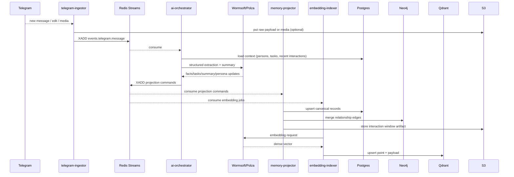
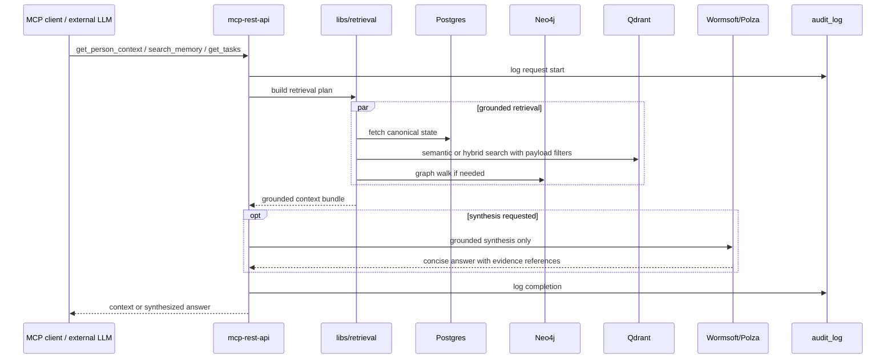
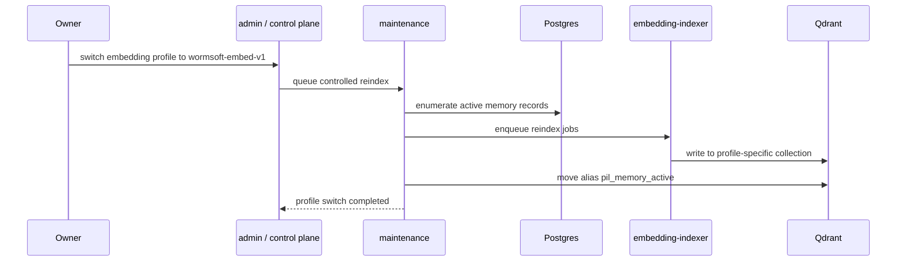
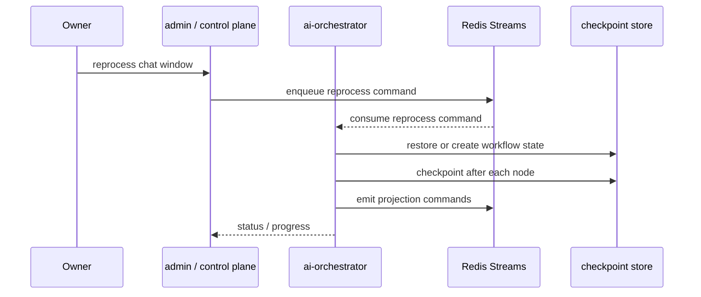

# Потоки данных

Ключевые sequence-диаграммы для целевой AI-архитектуры.

## 1. Message -> Memory

## 2. Retrieval through MCP/REST

## 3. Embedding profile switch

## 4. Reprocess / backfill with checkpoints

## Минимальные гарантии

- Каждое raw событие имеет стабильный `event_id`.
- Каждый projection command имеет собственный `command_id`.
- `memory-projector` и `embedding-indexer` идемпотентны.
- LLM output не применяется без schema validation.
- Routing decisions и provider results логируются отдельно от бизнес-сущностей.
