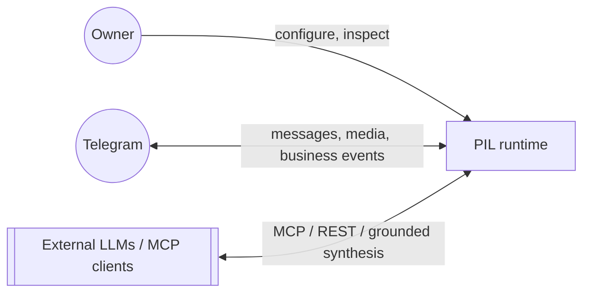
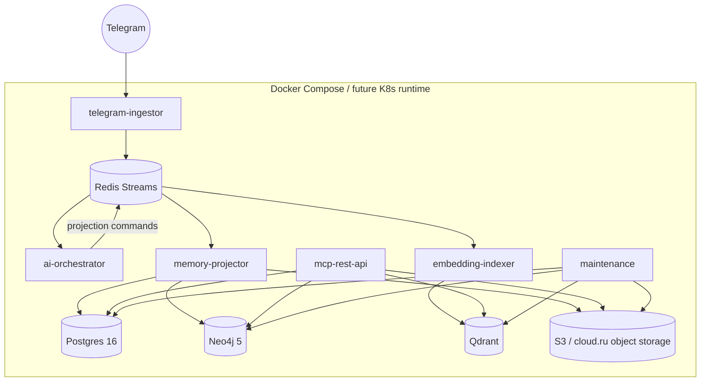

# System overview (C4 — Context & Container)

> Актуализация на 2026-05-13.
> Это supporting-документ к [ai-integrated-architecture.md](ai-integrated-architecture.md).
> Здесь зафиксированы текущий runtime и целевая контейнерная модель.

## C1. Контекст

- **Owner** — владелец инстанса.
- **Telegram** — источник событий и канал интеграции.
- **External LLMs / MCP clients** — потребители памяти и retrieval.

Важно: owner в целевой модели — это first-party principal, а не ordinary запись в списке внешних персон.

## Что уже реально поднято

На сервере уже работают:

- `postgres`
- `redis`
- `neo4j`
- `qdrant`
- `xray`
- `telegram-ingestor`
- `ai-orchestrator`
- `memory-projector`
- `embedding-indexer`
- `mcp-rest-api`
- `maintenance`

Это уже canonical AI runtime v1. Transitional extractor-сервисы сохраняются в репозитории только как исторический migration path.

## Целевая контейнерная модель

## Контейнеры и их ответственность

| Контейнер | Назначение | Технология |
|---|---|---|
| `telegram-ingestor` | Telegram ingestion, media upload, normalization, event publish | Python, Telethon / Bot API |
| Event Bus | transport для raw events и projection commands | Redis Streams |
| `ai-orchestrator` | LangGraph workflow, structured extraction, task routing | Python, LangGraph, LangChain, Pydantic |
| `memory-projector` | deterministic writes в Postgres, Neo4j, S3 | Python, SQLAlchemy / drivers |
| `embedding-indexer` | embeddings + Qdrant upsert | Python, OpenAI-compatible clients, Qdrant client |
| `mcp-rest-api` | retrieval API, MCP tools, optional grounded synthesis | Python, FastAPI |
| `maintenance` | retention, partitions, reindex jobs, profile switch jobs | Python, APScheduler |

## Переходный runtime vs target runtime

| Сейчас | Дальше |
|---|---|
| `entity-extractor` | переносится в `ai-orchestrator` |
| `persona-builder` | переносится в `ai-orchestrator` + `memory-projector` |
| `task-extractor` | переносится в `ai-orchestrator` |
| `chat-summarizer` | переносится в `ai-orchestrator` |
| `memory-distiller` planned | заменяется `embedding-indexer` |
| `graph-builder` planned | отдельный сервис не нужен, граф пишет `memory-projector` |

## Архитектурные принципы

- **Event-driven core.** Сервисы общаются через streams и storage, а не через RPC-цепочки.
- **Deterministic persistence.** LLM не пишет в базы напрямую.
- **Canonical-first storage.** Postgres — truth, остальное — projections.
- **First-party owner context.** Сообщения и устойчивые настройки владельца влияют на анализ людей, чатов и задач как отдельный context layer.
- **Canonical owner profile.** First-party identity уже хранится в `owner_profile`, а не только в transitional `person.is_owner`.
- **Canonical relationship context.** Owner→person и owner→chat сегментация хранится в `relationship_annotation`, а не только в free-form tags контактов.
- **Grounded retrieval.** API сначала ищет факты, потом синтезирует ответ.
- **Policy-driven LLM usage.** Provider routing и embeddings profile — отдельный управляемый слой.

## Что читать дальше

- [ai-integrated-architecture.md](ai-integrated-architecture.md)
- [components.md](components.md)
- [data-flow.md](data-flow.md)
- [tech-stack.md](tech-stack.md)
