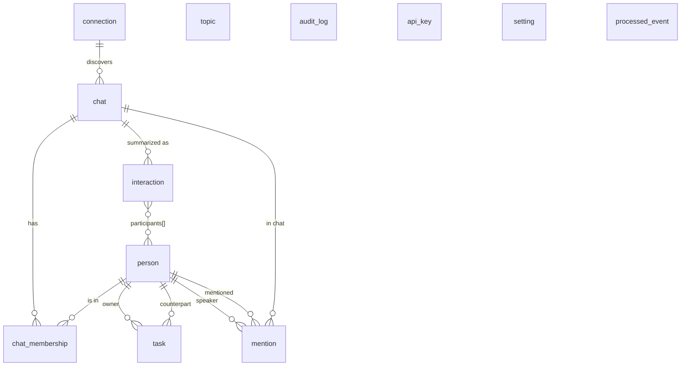

# Postgres schema

Каноническая модель PIL. Postgres — source of truth, остальные хранилища (Neo4j, Qdrant, object storage) — производные и должны быть восстанавливаемы из событий + Postgres.

## Соглашения

- Имена таблиц — snake_case, единственное число (`person`, `task`).
- Все таблицы имеют `id UUID PRIMARY KEY` (генерация — `uuidv7()` через `pg_uuidv7`), `created_at`, `updated_at` (`TIMESTAMPTZ`).
- Внешние ID (Telegram) хранятся как `tg_user_id BIGINT`, `tg_chat_id BIGINT`.
- Сложные структуры (теги, mentions counts) — `JSONB` с GIN-индексом, если запрашиваются.
- На горячие FK — индексы. Каждый — задокументирован.
- Партиционирование — `interaction`, `audit_log`, `processed_event` по `created_at` (monthly).
- Soft-delete не используем: erase = физический DELETE (см. privacy).

## Таблицы

### `connection`
Привязка Telegram-аккаунта/бота к инсталляции.
```sql
CREATE TABLE connection (
  id              UUID PRIMARY KEY DEFAULT uuidv7(),
  kind            TEXT NOT NULL CHECK (kind IN ('telethon_userbot','business_bot')),
  tg_user_id      BIGINT,                          -- для userbot: owner; для bot: bot_id
  display_name    TEXT,
  status          TEXT NOT NULL CHECK (status IN ('connected','disconnected','error')),
  metadata        JSONB NOT NULL DEFAULT '{}',     -- session refs, business_connection_id
  created_at      TIMESTAMPTZ NOT NULL DEFAULT now(),
  updated_at      TIMESTAMPTZ NOT NULL DEFAULT now()
);
```

### `chat`
Чат (диалог или группа). Allowlist выражается через `is_allowed`.
```sql
CREATE TABLE chat (
  id              UUID PRIMARY KEY DEFAULT uuidv7(),
  tg_chat_id      BIGINT NOT NULL UNIQUE,
  kind            TEXT NOT NULL CHECK (kind IN ('private','group','supergroup','channel')),
  title           TEXT,
  is_allowed      BOOLEAN NOT NULL DEFAULT FALSE,
  member_count    INT,
  metadata        JSONB NOT NULL DEFAULT '{}',
  created_at      TIMESTAMPTZ NOT NULL DEFAULT now(),
  updated_at      TIMESTAMPTZ NOT NULL DEFAULT now()
);
CREATE INDEX idx_chat_is_allowed ON chat(is_allowed) WHERE is_allowed = TRUE;
```

### `person`
Профиль внешнего контакта. В переходном runtime owner ещё может временно опираться на backing record с `is_owner = TRUE`, но это compatibility layer, а не целевая модель.
```sql
CREATE TABLE person (
  id              UUID PRIMARY KEY DEFAULT uuidv7(),
  tg_user_id      BIGINT UNIQUE,                    -- может быть NULL для людей, найденных через NER
  username        TEXT,
  display_name    TEXT NOT NULL,
  is_owner        BOOLEAN NOT NULL DEFAULT FALSE,
  bio             TEXT,
  role            TEXT,                              -- inferred role (например, «продакт-менеджер»)
  organizations   TEXT[] NOT NULL DEFAULT '{}',
  topics          TEXT[] NOT NULL DEFAULT '{}',     -- частые темы общения
  manual_tags     TEXT[] NOT NULL DEFAULT '{}',     -- вручную заданные теги владельца для сегментации
  communication_style TEXT,                          -- «краткий, по делу»
  trust_score     NUMERIC(4,3) NOT NULL DEFAULT 0.5 CHECK (trust_score BETWEEN 0 AND 1),
  last_interaction_at TIMESTAMPTZ,
  notes           TEXT,                              -- комментарий владельца к персоне
  blocked         BOOLEAN NOT NULL DEFAULT FALSE,    -- запрет ingestion-обработки
  created_at      TIMESTAMPTZ NOT NULL DEFAULT now(),
  updated_at      TIMESTAMPTZ NOT NULL DEFAULT now()
);
CREATE INDEX idx_person_username ON person(username);
CREATE INDEX idx_person_last_interaction ON person(last_interaction_at DESC);
CREATE INDEX idx_person_topics_gin ON person USING GIN(topics);
CREATE INDEX idx_person_organizations_gin ON person USING GIN(organizations);
CREATE INDEX idx_person_manual_tags_gin ON person USING GIN(manual_tags);
```

Целевое направление:

- `person` — только external people;
- owner — отдельный `owner_profile`;
- ручной контекст владельца относительно конкретного человека или чата — отдельная сущность `relationship_annotation`, а не самоописание owner как контакта.

Текущий runtime:

- owner уже вынесен в отдельную таблицу `owner_profile`;
- `person.is_owner` пока сохраняется как compatibility flag для части pipeline и historical data;
- manual tags / notes в `person` относятся только к внешним людям.

### `owner_profile`
Канонический first-party профиль владельца инстанса.
```sql
CREATE TABLE owner_profile (
  id              UUID PRIMARY KEY DEFAULT uuidv7(),
  backing_person_id UUID UNIQUE REFERENCES person(id) ON DELETE SET NULL,
  tg_user_id      BIGINT UNIQUE,
  username        TEXT,
  display_name    TEXT NOT NULL,
  preferred_language TEXT NOT NULL DEFAULT 'ru' CHECK (preferred_language IN ('ru','en')),
  context_tags    TEXT[] NOT NULL DEFAULT '{}',
  profile_notes   TEXT,
  last_interaction_at TIMESTAMPTZ,
  created_at      TIMESTAMPTZ NOT NULL DEFAULT now(),
  updated_at      TIMESTAMPTZ NOT NULL DEFAULT now()
);
CREATE INDEX idx_owner_profile_username ON owner_profile(username);
CREATE INDEX idx_owner_profile_context_tags_gin ON owner_profile USING GIN(context_tags);
```

Назначение:

- хранить first-party identity отдельно от списка внешних контактов;
- задавать стабильный language/context layer для LLM;
- давать управляемый owner context для сегментации людей, чатов и задач.

### `chat_membership`
Кто в каком чате.
```sql
CREATE TABLE chat_membership (
  chat_id         UUID NOT NULL REFERENCES chat(id) ON DELETE CASCADE,
  person_id       UUID NOT NULL REFERENCES person(id) ON DELETE CASCADE,
  joined_at       TIMESTAMPTZ NOT NULL DEFAULT now(),
  left_at         TIMESTAMPTZ,
  role            TEXT,                              -- 'admin', 'member', 'owner'
  PRIMARY KEY (chat_id, person_id)
);
```

### `interaction`
Скользящее резюме диалога (Interaction). Партиционируется по `created_at` помесячно.
```sql
CREATE TABLE interaction (
  id              UUID NOT NULL DEFAULT uuidv7(),
  chat_id         UUID NOT NULL REFERENCES chat(id) ON DELETE CASCADE,
  window_start    TIMESTAMPTZ NOT NULL,
  window_end      TIMESTAMPTZ NOT NULL,
  participants    UUID[] NOT NULL,                   -- person ids
  topics          TEXT[] NOT NULL DEFAULT '{}',
  sentiment       TEXT CHECK (sentiment IN ('positive','negative','neutral','mixed')),
  summary         TEXT NOT NULL,
  tasks           UUID[] NOT NULL DEFAULT '{}',      -- ids in task
  source_object_ref TEXT,                            -- s3 key для raw_window.json
  created_at      TIMESTAMPTZ NOT NULL DEFAULT now(),
  PRIMARY KEY (id, created_at)
) PARTITION BY RANGE (created_at);
-- Партиции создаются ежемесячно maintenance-сервисом.
CREATE INDEX idx_interaction_chat_window ON interaction(chat_id, window_end DESC);
CREATE INDEX idx_interaction_participants_gin ON interaction USING GIN(participants);
```

### `task`
Извлечённое обещание/задача.
```sql
CREATE TABLE task (
  id              UUID PRIMARY KEY DEFAULT uuidv7(),
  title           TEXT NOT NULL,
  description     TEXT,
  owner_person_id UUID REFERENCES person(id) ON DELETE SET NULL,
  counterpart_person_id UUID REFERENCES person(id) ON DELETE SET NULL,
  chat_id         UUID REFERENCES chat(id) ON DELETE SET NULL,
  source_message_ref JSONB NOT NULL,                 -- {tg_chat_id, tg_message_id, ts}
  due_at          TIMESTAMPTZ,
  status          TEXT NOT NULL DEFAULT 'open' CHECK (status IN ('open','done','dropped')),
  priority        SMALLINT NOT NULL DEFAULT 2 CHECK (priority BETWEEN 1 AND 5),
  confidence      NUMERIC(4,3) NOT NULL DEFAULT 0.5 CHECK (confidence BETWEEN 0 AND 1),
  evidence        TEXT,                               -- цитата, по которой извлекли
  resolved_at     TIMESTAMPTZ,
  created_at      TIMESTAMPTZ NOT NULL DEFAULT now(),
  updated_at      TIMESTAMPTZ NOT NULL DEFAULT now()
);
CREATE INDEX idx_task_owner ON task(owner_person_id) WHERE status='open';
CREATE INDEX idx_task_due ON task(due_at) WHERE status='open';
```

### `mention`
Денормализованные упоминания (для быстрого графа в Postgres до Neo4j).
```sql
CREATE TABLE mention (
  id              UUID PRIMARY KEY DEFAULT uuidv7(),
  chat_id         UUID NOT NULL REFERENCES chat(id) ON DELETE CASCADE,
  speaker_person_id UUID NOT NULL REFERENCES person(id) ON DELETE CASCADE,
  mentioned_person_id UUID NOT NULL REFERENCES person(id) ON DELETE CASCADE,
  message_ref     JSONB NOT NULL,
  context         TEXT,
  created_at      TIMESTAMPTZ NOT NULL DEFAULT now()
);
CREATE INDEX idx_mention_speaker ON mention(speaker_person_id);
CREATE INDEX idx_mention_mentioned ON mention(mentioned_person_id);
```

### `topic`
Канонические темы (нормализация tag'ов).
```sql
CREATE TABLE topic (
  id              UUID PRIMARY KEY DEFAULT uuidv7(),
  slug            TEXT NOT NULL UNIQUE,
  display_name    TEXT NOT NULL,
  description     TEXT,
  created_at      TIMESTAMPTZ NOT NULL DEFAULT now()
);
```

### `processed_event`
Идемпотентность.
```sql
CREATE TABLE processed_event (
  consumer_name   TEXT NOT NULL,
  event_id        TEXT NOT NULL,
  processed_at    TIMESTAMPTZ NOT NULL DEFAULT now(),
  PRIMARY KEY (consumer_name, event_id, processed_at)
) PARTITION BY RANGE (processed_at);
```

### `audit_log`
Аудит чтений/мутаций.
```sql
CREATE TABLE audit_log (
  id              UUID NOT NULL DEFAULT uuidv7(),
  ts              TIMESTAMPTZ NOT NULL DEFAULT now(),
  actor           TEXT NOT NULL,                    -- 'mcp:<api_key_id>' | 'ui:<owner>' | 'system'
  action          TEXT NOT NULL,                    -- 'read.person','erase.person','update.allowlist'...
  target          TEXT,                              -- id или составной ключ
  request_id      TEXT,
  duration_ms     INT,
  payload         JSONB,
  PRIMARY KEY (id, ts)
) PARTITION BY RANGE (ts);
```

### `api_key`
Ключи для внешних MCP-клиентов.
```sql
CREATE TABLE api_key (
  id              UUID PRIMARY KEY DEFAULT uuidv7(),
  name            TEXT NOT NULL,
  key_hash        TEXT NOT NULL UNIQUE,             -- bcrypt
  scopes          TEXT[] NOT NULL DEFAULT '{}',
  active          BOOLEAN NOT NULL DEFAULT TRUE,
  created_at      TIMESTAMPTZ NOT NULL DEFAULT now(),
  last_used_at    TIMESTAMPTZ
);
```

### `setting`
KV-настройки.
```sql
CREATE TABLE setting (
  key             TEXT PRIMARY KEY,
  value           JSONB NOT NULL,
  updated_at      TIMESTAMPTZ NOT NULL DEFAULT now()
);
-- Примеры ключей: 'retention.raw_message_days', 'llm.mode.entity', 'llm.mode.summarizer'.
```

## ER-диаграмма



## Object store layout (S3-compatible)

Объект-стор не имеет схемы как таковой, но keys структурированы:

```
raw/<yyyy>/<mm>/<dd>/<chat_id>/<message_id>.json
raw-media/<yyyy>/<mm>/<dd>/<chat_id>/<message_id>/<media_id>.<ext>
interaction-windows/<interaction_id>.json
backups/<yyyy-mm-dd>/postgres.sql.gz
backups/<yyyy-mm-dd>/neo4j.dump
backups/<yyyy-mm-dd>/qdrant/<collection>/snapshot.tar
export/<person_id>/<request_id>.zip
```

Lifecycle policy: `raw/` и `raw-media/` — auto-expire по `setting.retention.raw_message_days`.

## Миграции

- `migrations/postgres/` — Alembic.
- Шаг наименования: `YYYYMMDDHHMM_short_description.py`.
- Каждая миграция — append-only. Rollback допустим только в локальном dev.
- Перед PR — `alembic upgrade head` на чистом окружении должен проходить за < 60 сек.
- Партиции `interaction`, `processed_event`, `audit_log` создаются скриптом `services/maintenance` ежесуточно (на месяц вперёд).

## Тестовые фикстуры

- `tests/fixtures/sql/` — небольшие seed-наборы.
- Базовый детерминированный генератор фикстур: `scripts/dev/gen_fixtures.py`.
- После изменения fixture-схемы генератор нужно прогонять повторно и коммитить обновлённый bundle в `tests/fixtures/`.

## Открытые вопросы

- Q-PG-1. Использовать ли pgvector внутри Postgres для лайт-семантики, чтобы упростить топологию (Qdrant — лишний)? — рассматриваем в ADR-0004.
- Q-PG-2. Достаточно ли trust_score одного скаляра, или нужна структура (политика/конфиденциальность/проф.компетенция)?
