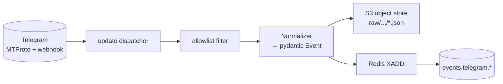

# Pipeline: Ingestion

`services/telegram-ingestor` — единственный источник правды для входящих событий Telegram.

## Каналы

### A. ~~Telethon userbot~~ (не используем)

Исключён в пользу Business Bot. Telethon требует MTProto-сессии и `API_ID/HASH`,
что усложняет деплой и нарушает ToS при агрессивном использовании.

### B. Business Bot (основной канал)

- Бот `@golematon_bot`, привязанный через **Настройки → Business → Chat Automation**.
- Канал событий: **long polling** через xray VLESS/Reality proxy (ISP блокирует Telegram DC на входящем трафике, поэтому webhook невозможен).
- Видим только то, что Telegram отдаёт в Business Mode (новые сообщения из личных чатов владельца аккаунта).
- Инфраструктура: `telegram-ingestor` (polling) → xray (VLESS/Reality outbound) → `api.telegram.org`.
- Публичный endpoint и Caddy **не нужны** — весь трафик исходящий.

## Что слушаем

| Источник         | Событие на шине                                    |
|------------------|-----------------------------------------------------|
| `events.NewMessage`           | `events.telegram.message`             |
| `events.MessageEdited`        | `events.telegram.message_edited`      |
| `events.MessageDeleted`       | `events.telegram.message_deleted`     |
| `events.ChatAction` (join/leave) | `events.telegram.chat_member`      |
| Business webhook `business_connection` | `events.telegram.business_connection` |
| Business webhook `business_message`    | `events.telegram.message` (с `via_business_bot=true`) |
| Business webhook `edited_business_message` | `events.telegram.message_edited`  |
| Business webhook `deleted_business_messages` | `events.telegram.message_deleted` |

## Поток



## Allowlist filter

- Подгружает `chat.is_allowed`, `person.blocked` из Postgres в локальный LRU-кеш (TTL 30 сек).
- Если чат не в allowlist — событие **не публикуем**, raw тоже **не сохраняем**.
- Исключение: `business_connection` всегда публикуется (это управление).

## Хранение raw

- В S3-compatible object storage в bucket `raw` по ключу `raw/<yyyy>/<mm>/<dd>/<chat_id>/<message_id>.json`.
- Содержит: исходный объект Telethon-update в JSON + headers нормализатора.
- TTL — `setting.retention.raw_message_days` (дефолт 90 дней). Lifecycle policy удаляет автоматически.
- Медиа складываются отдельно в `raw-media/...`. Лимит размера на сообщение — настройка (по умолчанию 25 МБ).

## Backfill

- Однократный импорт последних N сообщений при первом включении чата в allowlist.
- N — `setting.ingestion.backfill_count` (дефолт 200).
- Реализация: `services/telegram-ingestor` слушает событие `system.command{kind:'backfill_chat', args:{chat_id, count}}` и итеративно тянет историю Telethon.
- Каждое backfill-сообщение публикуется на шину с теми же контрактами + флагом `headers.backfill=true`.

## Идемпотентность ingestion

- `event_id = ULID(occurred_at, hash(tg_chat_id, tg_message_id, edit_version))`.
- Дубликаты от Telethon (re-delivery после reconnect) фильтруются по `event_id` через Redis SET `processed_ingestion:<event_id>` (TTL 24ч) — это lokal-side.

## Rate-limits

- Telethon встроенно соблюдает Telegram FloodWait.
- Внутри `telegram-ingestor` — token-bucket на исходящие webhook'и (для business-bot back-channel). Дефолт — 20 req/sec.

## Конфигурация

`infra/compose/.env`:

```
BOT_TOKEN=<токен из @BotFather>
REDIS_URL=redis://redis:6379/0
REDIS_PASSWORD=<пароль>
TG_PROXY_URL=http://xray:8080   # xray HTTP inbound

# xray VLESS/Reality
XRAY_VLESS_ADDRESS=<сервер>
XRAY_VLESS_ID=<uuid>
XRAY_REALITY_SNI=www.microsoft.com
XRAY_REALITY_PBK=<pubkey>
XRAY_REALITY_SID=<shortid>

# S3 cloud.ru (raw хранение — опционально, без ключей пропускается)
S3_ENDPOINT_URL=https://s3.cloud.ru
S3_ACCESS_KEY_ID=...
S3_SECRET_ACCESS_KEY=...
```

## Observability

- Метрики:
  - `pil_ingest_messages_total{kind, allowed}`
  - `pil_ingest_failures_total{stage}`
  - `pil_ingest_lag_seconds`
- Логи структурные с `trace_id` и `event_id`.
- Tracing — span на каждый update.

## Тесты

- Unit — нормализация Telethon-update в pydantic-модель.
- Integration — моки Telethon (`tests/fixtures/telegram_updates.json`) + реальный Redis (testcontainers).
- E2E — staging-аккаунт + временный бот (опц., запускается вручную).

## Open questions

- Q-ING-1. Стоит ли хранить голосовые сразу как mp3 или транскрибировать в момент ingestion? — влияет на ретеншен.
- Q-ING-2. Поддерживаем ли каналы (broadcast) или только диалоги/группы? MVP-1 — нет; MVP-2 — пересмотр.
