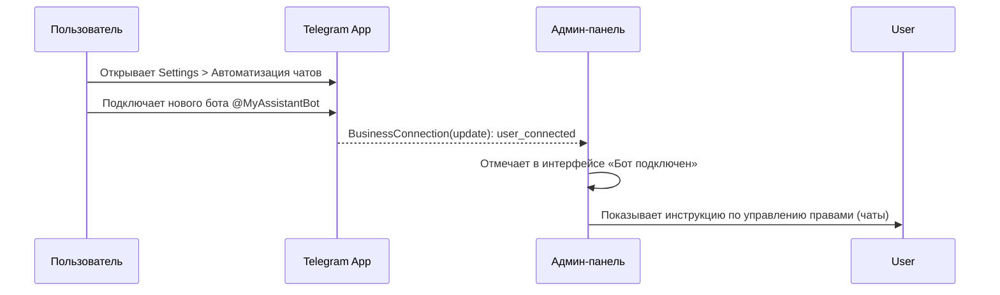
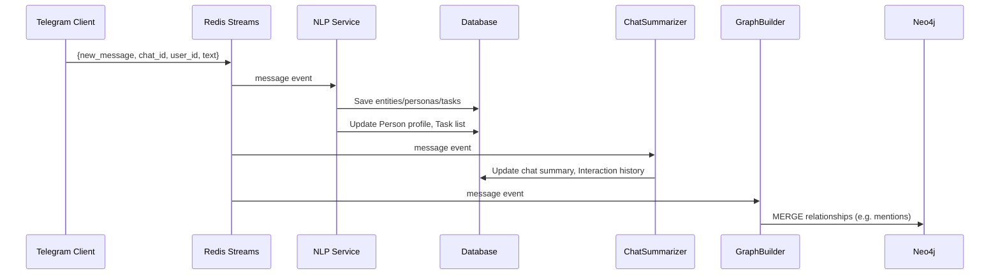

# Исполнительное резюме

> Этот документ сохраняется как исходный стратегический vision-док.
> Актуальная implementable-архитектура теперь описана в [02-architecture/ai-integrated-architecture.md](02-architecture/ai-integrated-architecture.md).

Новая функция «Chat Automation» (автоматизация чатов) в Telegram позволяет пользователям подключать AI-ботов к своему профилю и давать им доступ к выбранным чатам【29†L103-L109】. Это открывает путь для **личного интеллектуального слоя (Personal Intelligence Layer)** над Telegram, где бот выступает не как автоответчик, а как «оперативная память» вашего общения. Такая система отслеживает сообщения в личных и групповых чатах (согласно выбранным настройкам доступа), извлекает из них персоны, связи, задачи, темы и другой контекст, а затем предоставляет эту информацию внешним AI-агентам или ассистентам для повышения качества диалога и принятия решений.  

Например, бот по вашему заданию может выделять лица (именованные сущности), строить их «портреты» (роли, стиль общения, активные задачи), фиксировать обещания и дела, упоминания между людьми, обобщать содержание длинных переписок. Всё это хранится в гибридной памяти – реляционных таблицах (Postgres), графовой БД (Neo4j) и векторном хранилище (Qdrant). Такой личный «контекстный модуль» позволит любым подключённым LLM (ChatGPT, Claude и др.) оперировать знаниями о ваших контактах и текущих задачах как о внешней памяти при ответах и планировании.  

Ниже мы предлагаем архитектуру решения, описывающую компоненты и потоки данных, примерные схемы данных, диаграммы и дорожную карту разработки. Ключевыми источниками выступают официальные материалы Telegram【29†L103-L109】【34†L492-L500】 и наработки автора (репозитории *frontier-intelligence* и *telegram-assistant*), расширенные последними практиками GraphRAG【41†L1149-L1157】. В проекте особое внимание уделено приватности (только явный opt-in, локальное хранение, лимиты ретеншена) и эксплуатационным вопросам (резервное копирование, мониторинг, DLQ и т.д.).  

# Архитектура системы

```mermaid
flowchart LR
    subgraph Ingestion Layer
        A[Telethon Userbot / Business Bot] 
        A -->|Слушает сообщения| B[Event Bus (Redis Streams)]
    end
    subgraph Processing Pipelines
        B --> C[Extractor: Entities & Topics]
        B --> D[Extractor: Tasks & Commitments]
        B --> E[Persona Builder]
        B --> F[Chat Summarizer]
        B --> G[Relationship Graph Builder]
        B --> H[Memory Distiller (embedding)]
    end
    subgraph Storage Layer
        C --> I[(PostgreSQL)]
        D --> I
        E --> I
        F --> I
        G --> J[(Neo4j Graph DB)]
        H --> K[(Qdrant Vector DB)]
        F --> L[(Object Storage)]
    end
    subgraph Interface Layer
        I --> M[MCP/AI Agents (via API)]
        J --> M
        K --> M
        UI[Admin Web UI] --> I
        UI --> J
        UI --> A
    end
    click A "https://core.telegram.org/bots/features#bots-for-business" "Telegram Bot API: BusinessConnection (Chat Automation)【34†L492-L500】"
```

- **Ingestion Layer**: Телеграм-клиент (пользовательский Telethon или бот в режиме «Business»【34†L492-L500】), получающий сообщения от пользователя и допустимых чатов. Эти события прокидываются в **Event Bus** (например, Redis Streams или Kafka) в виде входящих сообщений.  
- **Processing Pipelines**: Набор микросервисов, которые асинхронно читают из шины событий и выполняют NLP-задачи: извлечение сущностей (имена, организации, темы), классификация роли/стиля диалога, вычленение TO-DO/Promises, эмоциональный анализ, суммаризация диалогов, построение графа упоминаний. Каждый компонент публикует результаты в БД или другие очереди.  
- **Storage Layer**: 
  - *PostgreSQL* для структурированных данных: профиль персона (Person), список задач (Task), дайджесты чатов (Interaction) и т.д.  
  - *Neo4j* для хранения графов взаимоотношений между людьми, организациями и темами (Relationship Edge). Это ускоряет запросы вида «покажи связи между А и Б».  
  - *Qdrant* (векторное хранилище) для семантической памяти: embeddings сообщений, абстрактов, памятных заметок. Это позволяет быстро искать похожие ситуации или контакты по смыслу【41†L1149-L1157】【41†L1181-L1185】.  
  - *Object Store* (MinIO/S3) для крупных данных: фотографии, документы, аудио-стран, логов.  
- **Interface Layer**: Сервисы для конечных пользователей и агентов:
  - **MCP/AI Agents API**: даёт доступ к скомпилированному контексту (persona, граф, недавние резюме, открытые задачи и т.д.) любому LLM или тулкейту. Это может быть REST/gRPC-интерфейс (использует граф-RAG, retrieval-API).  
  - **Админ-панель**: веб-интерфейс для настройки и мониторинга (привязка бота, whitelist чатиков/контактов, параметры моделей, политик хранения).  
- **Telegram Integration**: Для привязки бота и получения событий используется **режим Business / Chat Automation**. При подключении бота пользователь настраивает, к каким чатам он будет иметь доступ【29†L103-L109】. Разработчик должен обрабатывать *BusinessConnection*-события (по которому узнаёт, когда пользователь добавил/удалил бота) и *business_message* (сообщения от пользователей)【34†L492-L500】. 

Эта архитектура (на основе event-driven паттернов) перекликается с имеющимся стеком Frontier Intelligence и телеграм-ассистентов автора, но расширена под задачи «социальной памяти» и GraphRAG. Ключевым здесь является разделение на ядро сбора данных и «камень-ретривальных» слоёв, что обеспечивает масштабируемость и гибкость.

# Компоненты системы и их API

- **Telegram Ingestion Service (Userbot/BusinessBot)**  
  - Запускается на API Telethon/Pyrogram или Bot API (Business Mode).  
  - Получает обновления: новые сообщения, ответы, редактирования, удаления.  
  - Выбрасывает в шину событий (`Redis Streams`): события типа `message_received`, `chat_joined`, `business_message` с полезными полями (текст, id чата, id отправителя).  
  - **API:** см. методы Telethon/Pyrogram (recv updates) или Bot API (Updates).  
  - **Защита:** локальный session-файл (Telethon) или токен бота с Business Mode.  

- **Event Bus (Redis Streams/Kafka)**  
  - Хранит событийные очереди с поддержкой нескольких consumer-групп, DLQ и XAUTOCALIM.  
  - Каждый Event: { type: "new_message", message_id, chat_id, user_id, timestamp, content }.  
  - **API:** `XADD`, `XREADGROUP`, группы.  

- **Entity Extractor Service**  
  - Обрабатывает текстовые события, извлекает именованные сущности (имена людей, организации, локации) и ключевые темы (NER + Topical Analysis).  
  - Записывает в Postgres: связи { Person ↔ entity }.  
  - Может обращаться к wiki/API для распознавания роли (напр. «Олег Петрович — CEO Газпрома»).  
  - **API:** получает события, отдаёт JSON сущностей.  

- **Persona Builder Service**  
  - Для каждого человека (User ID) собирает историю сообщений и резюмы (Tone, FrequentTopics, Style).  
  - Обновляет таблицу `Person`: (name, bio, style, last_active, trust_score и т.д.).  
  - Возможно использует LLM/RAG для классификации черт (ключевые интересы, стиль общения).  
  - **Выход:** обновлённый профиль личности.  

- **Task/Commitment Extractor**  
  - Ищет в сообщениях обещания, задачи и дедлайны (по ключевым словам: «нужно», «давай завтра», «к дедлайну», «TODO»).  
  - Создаёт записи Task: (title, связанный человек, приоритет, статус, ссылка на message_id).  
  - Позволяет ботy отвечать на запросы «что мне сейчас нужно сделать по проекту X?».  
  - **Хранилище:** таблица `Tasks` в Postgres.  

- **Chat Summarizer Service**  
  - Разбивает длинные чаты на темы (напр., каждые N сообщений или по диалоговым веткам).  
  - Генерирует краткие рефлексы (с помощию LLM/кратких моделй или алгоритмически).  
  - Сохраняет summary в Postgres или Qdrant.  
  - Позволяет быстро реконструировать суть за период или перед встречей.  

- **Relationship Graph Builder**  
  - Использует Neo4j: строит узлы для Person и Organization, ребра (knows, mentions, works_for, same_chat).  
  - Например, если А несколько раз упоминает В, создаётся ребро A→B с весом.  
  - Способен обновлять метрики «сила связи» по частоте общения.  
  - **Cypher API:** служба имеет подключение к Neo4j и выполняет `MERGE`, `CREATE` и пр.  

- **Memory Distiller**  
  - Анализирует старые события (например, по cron): выбирает важные события и конспектирует их.  
  - Генерирует семантические векторы (напр., через OpenAI/Claude API или локальные embedding-модели) и сохраняет их в Qdrant.  
  - Т.е. долгосрочная память: «что мы знаем про Алексея?».  

- **MCP/Query Service**  
  - Интерфейс для запросов. При запросе контекста (`get_person_context`, `get_chat_summary`), комбинирует данные из всех хранилищ:
    - Из Neo4j: близких контактов и ролей.
    - Из Postgres: открытых задач и недавних резюме.
    - Из Qdrant: семантически релевантных сообщений.  
  - Отдаёт структурированный JSON/markdown, который уже можно подать в LLM.
  - **Пример API:** `/context/person?user_id=123`, возвращает Person, recent_topics, open_tasks, recent_interactions.  

- **Admin UI (Web)**  
  - Личный кабинет для владельца (или админа) системы:
    - Показывает статус подключения бота (BusinessConnection).
    - Управление **Bot Attachment**: инструкции/ссылки, как подключить/отключить бота в Telegram (через «Настройки > Автоматизация чатов»【29†L103-L109】).
    - Список разрешённых чатов (whitelist chats) и пользователей (whitelist persons). Позволяет вручную добавить/убрать.
    - Настройки ретеншена (через сколько дней чистить старые данные).
    - Параметры LLM/моделей (ключи API, локальные модели).
    - Мониторинг очередей (DLQ, задержки) и статистика (кол-во событий, топ-темы).
  - **Вход:** можно реализовать через «Login via Telegram» (OAuth) или через API-ключ администратора.  

# Примеры схем данных (JSON)

**Person** – профиль контакта/пользователя:
```json
{
  "person_id": "tg_123456789",
  "name": "Алексей Иванов",
  "username": "@alex_ivanov",
  "organizations": ["Компания XYZ"],
  "role": "Продакт-менеджер",
  "last_interaction": "2026-05-09T14:23:00Z",
  "trust_score": 0.84,
  "topics": ["AI", "Design", "Automotive"],
  "communication_style": "краткий, по делу",
  "notes": "Любит упоминать дедлайны и инновации"
}
```

**Interaction (Chat Summary)** – резюме диалога или переписки:
```json
{
  "interaction_id": "intf_20260509_ABC",
  "chat_id": -1001234567890,
  "participants": ["tg_123456789","tg_987654321"],
  "time_window": {
    "start": "2026-05-05T10:00:00Z",
    "end": "2026-05-09T14:00:00Z"
  },
  "topics": ["QG тестирование", "маркетинговая презентация"],
  "sentiment": "mixed",
  "tasks": ["Подготовить презентацию по маркетингу","Уточнить цифры по QG"],
  "summary": "Обсуждался процесс тестирования «Quality Gate», участники договорились подготовить маркетинговую презентацию. Алексей попросил уточнить сроки и ресурсы."
}
```

**Relationship Edge** – ребро в графе связей:
```json
{
  "from_person": "tg_123456789",
  "to_person": "tg_987654321",
  "relation": "mentioned", 
  "weight": 0.27,
  "contexts": [
    "В чатах связанных с маркетингом упоминалась тесная работа"
  ]
}
```
(Тип relation может быть: `mentioned`, `works_with`, `boss_of`, `friend`, и т.д.)

**Task (Commitment)** – активная задача или обязательство:
```json
{
  "task_id": "task_654321",
  "title": "Отредактировать дорожную карту AI-проекта",
  "description": "Алексей упоминал о необходимости обновить документ до 15 мая",
  "assigned_to": "tg_123456789",
  "due_date": "2026-05-15",
  "status": "open",
  "context": {
    "chat_id": -1001234567890,
    "message_id": 34567
  }
}
```

**Memory Chunk** – элемент семантической памяти:
```json
{
  "memory_id": "mem_789123",
  "created_at": "2026-05-10T09:00:00Z",
  "type": "summary", 
  "content": "В прошлом месяце Алексей провёл встречу по улучшению UX в автомобильном проекте.",
  "vector": [0.00123, -0.4567, ..., 0.0789],  // embedding
  "linked_persons": ["tg_123456789","tg_1122334455"],
  "source": {"chat_id": -1001122334455, "message_id": 98765}
}
```
(Содержимое хранится в Qdrant с вектором; `type` может быть «note», «idea», «summary».)

# Сценарии и последовательности событий

## Привязка бота к профилю


- Пользователь через UI Telegram добавляет бота к профилю.  
- Telegram отправляет боту событие *BusinessConnection* об установлении связи【34†L492-L500】. Система записывает, что бот «привязан».  
- Админ-панель получает уведомление (в webhook или из очереди) и отображает статус.  
- В панели далее можно вызвать «Manage Bot» (Глубокая ссылка) или самостоятельно в Telegram ограничить чаты, в которых бот сможет работать.

## Ингестия и обработка сообщений


1. **Telethon** (или Bot API) получает новое сообщение из разрешённого чата.  
2. Публикует событие `new_message` в **Event Bus**.  
3. **Сервисы-обработчики** читают это событие:  
   - **Entity/Persona**: распознаёт упоминания людей, тем, организации → сохраняет в Postgres.  
   - **Task Extractor**: выделяет задачи по ключевым словам → создаёт/обновляет записи Tasks.  
   - **Summarizer**: по расписанию генерирует обновлённые summary→ сохраняет в Interaction таблице.  
   - **Graph Builder**: обновляет связи между участниками чата в Neo4j.  

Таким образом, каждая ветка системы работает независимо, но обогащает **память контакта**.  

## Запрос контекста через MCP (Multi-Agent Planner)

```mermaid
sequenceDiagram
  participant Agent as AI-агент (LLM)
  participant MCP as MCP Server
  participant DB as {Postgres, Neo4j, Qdrant}
  Agent->>MCP: "С кем из моих контактов в машине был Пётр?"
  MCP->>DB: Query Person A, related Graph, open Tasks
  DB-->>MCP: Alice (Пётр), Graph Relations, Tasks
  MCP->>Agent: {
     "person": {"name": "Пётр","relation": "коллега"},
     "recent_topics": ["машины","AI"],
     "open_tasks": [...]
  }
```
- AI-агент (например, LLM) спрашивает систему через MCP API: «кто этот человек и что нам обсуждать».  
- MCP обходит Postgres/Neo4j/Qdrant, извлекая профиль, связи, задачи, недавние темы.  
- Возвращает скомбинированный ответ, который можно сразу подавать модели.  

# Админ-интерфейс: прикрепление бота и настройки

**Главная страница**: список подключённых аккаунтов/ботов. Для каждого — статус (подключён/отключён), кнопка «Отключить/Удалить».  

**Страница бота**:  
- **Подключение бота**: инструкция «перейдите в Telegram > Настройки > Автоматизация чатов и выберите @MyAssistantBot для доступа к чатам». (Ссылки в BotFather для Business Mode можно здесь дать.)  
- **Права доступа**: отображается список чатов с галочками. Пользователь вручную настраивает в Telegram, но здесь можно импортировать текущий список из события BusinessConnection (какие чаты разрешены).  
- **Whitelist Пользователей**: список контактов, по которым нужно строить отдельные персональные профили. Можно добавить фильтр по username или ID.  
- **Стратегия ретеншена**: выбрать политику, напр. «хранить raw-сообщения 30 дней, затем удалять», «архивировать в long-term память».  
- **Модели и API**: настройки (ключи OpenAI/GCP или пути к локальным моделям, язык обработки и т.д.).  
- **Мониторинг**: графики загрузки, задержки очередей, последние ошибки. Ссылки на лог (DLQ).  

**Потоки UX**:  
- При добавлении бота через Telegram пользователь сразу увидит в админке статус «Подключён».  
- Удаление бота: админ нажимает «Удалить связь», система отправляет пользователю инструкцию откатить в Telegram, очищает локальные данные.

# Поэтапный план (Roadmap)

| Фаза | Задачи | Результат | Оценка усилий |
|:-----|:------|:----------|:--------------|
| **MVP-1: Ядро сбора** | – Реализовать Telethon-интеграцию (или Bot API BusinessMode)<br>– Пайплайны entity/task/extraction<br>– БД Postgres (Person, Task, Interaction)<br>– Простые резюмы чатов<br>– Базовый MCP-интерфейс «получить резюме» | Сбор персонажей и задач из 1:1 и групповых чатов; ключевые данные в БД | Средний |
| **MVP-2: Граф и память** | – Подключить Neo4j, строить граф связей (mentions, org)<br>– Интегрировать Qdrant для хранения embeddings (семантика)<br>– Улучшенные резюме (LLM), более сложный Entity Parser<br>– Админ UI (простая настройка чатов/контактов) | Семантический поиск по прошлым диалогам; «контекстные» запросы (graph-RAG) | Средний |
| **MVP-3: масштабность и UX** | – Мультиаккаунтность: Kubernetes / Docker Compose, сервисы шардирования<br>– UI-дешборд мониторинга, политики ретеншена<br>– Поддержка видео/аудио (speech-to-text)<br>– Горячие загрузки (push-уведомления агента) | Готовый к продакшен сервис с отказоустойчивостью и анализом любых форматов | Высокий |

**Оценка усилий** дана условно (низкий/средний/высокий) по объёму работы:
- *MVP-1* (сбор данных и основных NLP) – основная логика, ~2-3 месяца одного инженера.
- *MVP-2* (графы и память) – ~2 месяца, потребует настройки БД (Neo4j, Qdrant).
- *MVP-3* (инфраструктура) – ~2 месяца, CI/CD, безопасность, UX.

# Приватность и соответствие (Privacy & Compliance)

- **Опт-ин и Согласие**: бот обрабатывает **только** чаты, которые пользователь явно выбрал (через Chat Automation)【29†L103-L109】. Нельзя «подслушивать» нежелательные беседы.  
- **Минимизация данных**: храним лишь извлечённые факты и сводки, а не необработанный dump переписок. Сырой текст сообщений можно удалять через N дней.  
- **Шифрование**: хранение чувствительных данных (ключи токенов, сессий) – в зашифрованном виде. Трафик к внешним LLM – по HTTPS.  
- **GDPR & CCPA**: для юзеров из ЕС соблюдать право на удаление («забыл меня») – добавлять механизм удаления данных по требованию.  
- **Безопасность бота**: выполнять требования Telegram Bot API ToS и BusinessMode (нельзя рассылать спам, обрабатывать контент без разрешения)【34†L508-L512】.  
- **Локальность**: по возможности размещать весь стек на локальном сервере/VM пользователя (контроль данных), или использовать проверенные хранилища (например, Self-hosted Postgres/Neo4j/Qdrant) с пулом разрешений.  
- **Аудит и Логи**: вести запись действий системы (who did what) для разбирательств.  

# Технологический стек и развёртывание

**Языки и фреймворки**: Python 3.x (Telethon/Pyrogram, FastAPI), JS/React для UI. Очереди – Redis Streams (или Kafka). БД – PostgreSQL, Neo4j, Qdrant (все Docker-контейнеры доступны).  

**Хостинг LLM**:  
- *Облачные* (OpenAI, Claude): просты в интеграции, мощные модели, но платные и менее приватные. Используем для сложных NLP (парсинг, генерация суммарий).  
- *Локальные* (LLama, Mixtral, Falcon и т.д.): полная приватность и offline-возможности, но требуют GPU и настройку ML-инфраструктуры. Подходят для базовых embedding и некоторых задач (NER, Q&A).  

| Хостинг LLM | Плюсы | Минусы |
|:-----------|:------|:-------|
| Облако (OpenAI) | Высокое качество, всегда актуально, «напрямую» доступно | Зависимость от API, стоимость, задержки, приватность (данные у провайдера) |
| Локально (LLMs) | Полный контроль, нет внешней зависимости, низкая латентность | Нужен мощный сервер/GPU, сложнее обновлять модели, ограниченный размер контекста |

**Память (RAG) vs API**:  
- *Ретривал (вектор+граф)* – быстро для больших историй, позволяет комбинировать знание.  
- *Запрос всех сообщений* – неэффективно и может превысить лимиты LLM.

**Сравнение хранилищ**:

| Система     | Назначение                    | Плюсы                           | Минусы                        |
|:------------|:------------------------------|:-------------------------------|:------------------------------|
| PostgreSQL  | Реляционные данные (Person, Tasks, Summaries) | Удобно для транзакций и SQL-запросов (задачи, списки). Широкая экосистема. | Сложно хранить графы/семантику (нужно доп. колонки). |
| Neo4j       | Граф связей (Relation Edge)   | Оптимизирован для запросов по графам («кто с кем знаком»). Гибкая модель. | Доп. инфраструктура, поверхностные знания. |
| Qdrant      | Семантическая память (embeddings) | Быстрый поиск по смыслу, векторный поиск больших документов. | Хранит вектора, но не структурированные данные. |
| Object Store (MinIO) | Файлы, вложения, логи            | Хранит неструктурированные данные (скриншоты, аудио). | Для SQL/поиска не подходит. |

**Ретеншн-политика**:

| Тип данных       | Хранение         | Ретеншен        |
|:-----------------|:-----------------|:---------------|
| Raw-сообщения    | (object store)   | 1–3 мес (hot), затем удаляются |
| Структ. сущности / Задачи | (Postgres)       | 1–5 лет (в зависимости от политики) |
| Граф связей      | (Neo4j)          | Постоянно (с периодической очисткой старых узлов) |
| Семантические векторы (Qdrant) | (Qdrant)      | Неограниченно (требует масштабирования) |
| Логи/метрики     | (ELK/Sentry)     | 30–90 дней       |

**Развёртывание**:  
- **Single-VM (MVP)**: Docker Compose со всеми контейнерами (Telethon, Redis, Postgres, Neo4j, Qdrant, UI, лямбда-скрипты). Можно запустить на одной виртуальной машине или мощном хосте.  
- **Multi-node (продакшен)**: Kubernetes (Helm charts). Микросервисы развёртываются в `Deployments`, Redis/Neo4j/Qdrant – в StatefulSets. Ingress + TLS. Мониторинг (Prometheus + Grafana) и алертинг для очередей и бэкапов.  

**Безопасность**:  
- Docker/K8s с ограничениями ресурсов (CPU/GPU/Memory лимиты), аутентификация сервисов (JWT, OAuth для API).  
- Регулярные бэкапы БД/графа/векторов (интегрировать cronjobs, и резервный объектный стор).  
- Мониторинг через Prometheus (метрики обработки, задержки очередей), Sentry для ошибок Python.

Таким образом, предложенная архитектура и стэк технологий обеспечивают полный «Personal Intelligence Layer»: от сбора данных до интеграции с LLM, при сохранении конфиденциальности и гибкости расширения. Мы опираемся на новые возможности Telegram (Chat Automation)【29†L103-L109】【34†L492-L500】, и на лучшие практики в области Graph-RAG【41†L1149-L1157】【41†L1181-L1185】 для достижения богато контекстного и персонализированного ассистента.  
