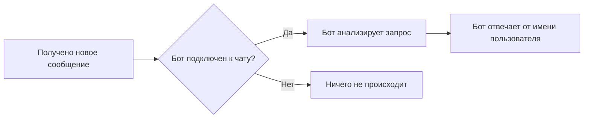
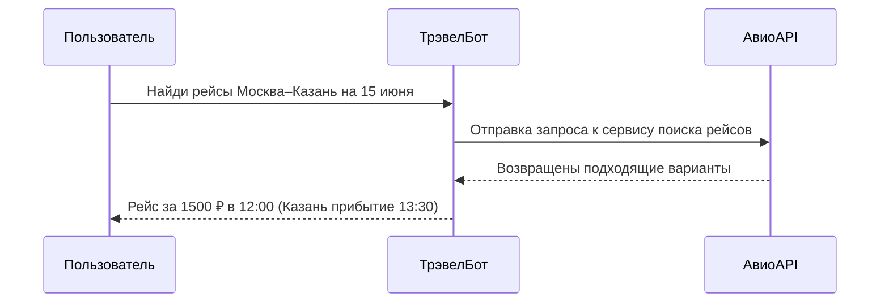

# Привязка ботов к аккаунту Telegram: подробный анализ функции и практические кейсы

**Резюме:** Telegram представил функцию «Автоматизация чатов», которая позволяет связать бота с пользовательским профилем и давать ему разрешение отвечать на сообщения от имени пользователя【24†L108-L113】【16†L139-L143】. В отличие от обычных ботов (отдельных аккаунтов в приложении), привязанный бот не выступает самостоятельным контактом: он работает под вашим именем и «отправляет» ответы как будто вы сами написали. Пользователь может настроить, к каким чатам бот получит доступ (например, только к новым диалогам или ко всем чатам, кроме контактов)【24†L108-L113】【26†L68-L73】. Это открывает новые сценарии личного использования: боты могут стать интеллектуальными помощниками для повышения продуктивности (планирование задач, напоминания, составление писем), генерации контента (тексты, изображения), управления финансами и здравоохранением, предоставлять справку по обучению или путешествиям и т.д. Отчет подробно рассматривает ключевые сценарии (продуктивность, приватность/безопасность, автоматизация, личный помощник, генерация контента, платежи/финансы, планирование, здоровье, обучение, помощь в кодировании, путешествия), приводит примеры 8–10 типов ботов для личных чатов (для каждого: цель, возможности, схема взаимодействия, требуемые разрешения, риски приватности, пример команд). Отдельно обсуждаются риски и меры предосторожности при использовании привязанных ботов, рекомендации по настройке и выбору надежных ботов, а также сравнение этих ботов в таблице. В конце приведены образцы диалогов (2–3 строки) для четырех типовых ботов и диаграммы-схемы взаимодействия (Mermaid) для иллюстрации потоков сообщений. В работе использованы официальные материалы Telegram и авторитетные источники【24†L108-L113】【26†L68-L73】【28†L23-L31】【11†L121-L128】【22†L126-L134】.

## Описание функции «Автоматизация чатов»

С выходом обновления 7 мая 2026 года Telegram официально внедрил функцию **«Автоматизация чатов»** (Chat Automation). Теперь любой пользователь может **подключить бота к своему профилю** и разрешить ему отвечать на сообщения от своего имени【24†L108-L113】. При настройке можно указать, **каким чатам** даст доступ бот: к новым сообщениям во всех чатах, только к диалогам с незнакомыми пользователями, ко всем чатам кроме ваших контактов и т.д.【24†L108-L113】【26†L68-L73】. Для подключения бота нужно зайти в меню _Настройки → Автоматизация чатов_ и выбрать нужного бота【24†L108-L113】. После этого бот начинает функционировать как ваш «личный ассистент» внутри тех чатов, к которым у него есть доступ.

Главное отличие от **обычных ботов** в Telegram – тот факт, что привязанный бот отвечает **не от своего имени**, а **от имени пользователя**. Обычный бот добавляется в чат или упоминается по @username и в ответ отправляет свои сообщения как отдельный собеседник【7†L83-L85】. В случае же привязанного бота его сообщения визуально выглядят как от вашего аккаунта (то есть собеседник видит «ваше» сообщение). Таким образом бот получает возможность **автоматизировать рутинные ответы и задачи**: он сам «видит» входящие сообщения в разрешенных чатах и может реагировать на них по заданным правилам или командам. По сути привязанный бот – это гибрид чат-бота и персонального ассистента пользователя.

Telegram подчёркивает, что при работе через автоматизацию бот получает доступ **только к сообщениям в разрешенных чатах**. Это не «гостевой бот», который отвечает только по упоминанию и не видит историю чата【7†L83-L85】, а именно «виртуальный представитель» пользователя. Бот *не* видит вашу адресную книгу или переписки, которые вы не указали в настройках. Тем не менее следует помнить: в разрешенных чатах бот получает **весь текст сообщений**, которые в них поступают, и может обрабатывать эту информацию.

## Преимущества и сценарии использования

Привязка бота к аккаунту открывает ряд новых практических возможностей в личных чатах. Ниже перечислены основные **преимущества и примеры сценариев** (не исчерпывающий список):

- **Продуктивность и автоматизация задач.** Бот может автоматически обрабатывать часто повторяющиеся запросы и выполнять рутинные операции, освобождая время пользователя. Например, бот-ассистент может создавать задачи и напоминания по вашим сообщениям (календарь, to-do-лист), автоматически отвечать на стандартные вопросы (например, «Можешь ли ты отправить мне документы?») или пересылать информацию по шаблону. Это позволяет не отвлекаться на мелочи и фокусироваться на важных делах.

- **Личный ИИ-ассистент.** Подключенный бот может выступать в роли персонального помощника с элементами искусственного интеллекта. Он способен отвечать на справочные запросы (поиск информации, факты), поддерживать диалог, помогать с планированием дня, генерировать идеи и т.д. Благодаря интеграции с мощными языковыми моделями (ChatGPT, Gemini, Claude, собственными ИИ Telegram) такой бот может писать письма, давать советы или переводить текст. Это превращает мессенджер в **«универсальный сервис AI»**, где вы обращаетесь к боту как к коллеге или помощнику.

- **Генерация контента.** Боты могут создавать тексты и мультимедиа по запросу пользователя. Например, текстовый генератор поможет составить электронное письмо, резюме, рекламный пост или рассказ по теме, заданной пользователем. С помощью ИИ-бота можно в одно действие получить черновик сообщения или ответ на сложный вопрос. Кроме того, существуют интеграции с генераторами изображений: отправив боту запрос или описание, можно сразу получить картинку, иллюстрацию или инфографику.

- **Планирование и напоминания.** Боты могут работать как умный календарь. Пользователь через бот быстро создает события (встречи, задачи, напоминания) и получает уведомления. Например, написав боту «Напомни мне завтра в 9:00 выпить лекарство», вы получите напоминание вовремя. Бот умеет повторять напоминания, удалять или изменять задачи по команде. Это особенно полезно для занятых людей, чтобы ничего не забывать.

- **Здоровье и фитнес.** В телеграме есть боты для отслеживания физической активности и здоровья. Подключенный бот может собирать данные о тренировках, питании и режиме, присылать ежедневные напоминания о воде и упражнениях, предлагать планы тренировок или расписания сна. Например, бот-коуч может спросить утром о вашем самочувствии и к вечеру предложить подходящую тренеровку или ментальную практику.

- **Обучение и языковая практика.** Языковые и образовательные боты помогают учить иностранные языки и другие темы. С ними можно практиковать разговор (бот-репетитор), получать тесты/викторины и перевод. Например, отправляя боту фразу на иностранном языке, вы сразу получите её перевод и объяснение грамматики. Или задать боту вопрос по школьному предмету и получить понятное объяснение. Такой бот превращает ваши чаты в учебный инструмент.

- **Помощь в программировании.** Специализированный бот для программистов может подсказывать примеры кода, объяснять ошибки и помогать с задачами разработки. Можно задать боту технический вопрос («Как написать функцию сортировки?») и получить готовый фрагмент кода или ссылку на документацию. Такой бот работает как быстрый офлайн-консультант по программированию.

- **Путешествия и справочная информация.** Бот-тревел-помощник может искать билеты и отели по запросу, строить маршруты, проверять расписание транспорта, напоминать о документах для поездки. Например, пользователь отправляет боту даты и направления, а бот возвращает оптимальные варианты перелетов и отелей. Он может подсказывать погоду в местах поездки, переводить фразы на нужный язык или считать расходы в разных валютах.

- **Финансы и платежи.** Боты для управления личными финансами популярны в Telegram. Они позволяют **учитывать расходы**, отслеживать бюджет и получать финансовую аналитику прямо в чате【28†L23-L31】. Вместо отдельного приложения вы просто отправляете боту сообщение вида «магазин 500» – и бот записывает покупку в нужную категорию. По запросу он показывает сводки расходов за неделю или месяц. Telegram также поддерживает встроенные платежи, поэтому в перспективе можно ожидать ботов, которые помогают оплачивать услуги или отправлять деньги через чат.

- **Безопасность и конфиденциальность.** Привязанный бот может усиливать безопасность: анализировать входящие сообщения на признаки фишинга или спама, уведомлять о подозрительных ссылках, помогать быстро блокировать нежелательных отправителей. Таким ботом можно автоматизировать проверку URL (например, бот-антивирус сканирует ссылки в сообщениях и предупреждает об опасности). Также бот может просить дополнительную аутентификацию для важных команд. При правильной настройке он повышает общую безопасность переписок.

По оценкам аналитиков, Telegram превратился в одну из самых мощных платформ для персональных финансовых ботов【28†L23-L31】. Главное преимущество – все сервисы доступны прямо внутри привычного интерфейса чата, без необходимости переключаться между приложениями. 

## Примеры ботов для личных чатов

Ниже приведены **8–10 примеров** перспективных ботов (типов/концепций) для личного профиля в Telegram, подходящих под функцию привязки. Для каждого указаны цель, ключевые возможности, сценарий работы, требуемые разрешения и соображения по конфиденциальности. Также приведены примеры команд или запросов.

- **Личный ИИ-ассистент (универсальный бот):**  
  - *Цель:* выполнять широкий спектр запросов «по требованию» – отвечать на вопросы, помогать в планировании, генерировать тексты и т.д.  
  - *Ключевые функции:* генерация текста на основе запроса (письма, отчёты, идеи), поиск информации (википедия, интернет), перевод, организация данных. Может иметь контекст диалога (помнит недавние сообщения) и работать как голосовой ассистент (при интеграции с голосовым вводом).  
  - *Сценарий:* пользователь пишет боту запрос («Как оптимизировать бюджет на рекламу?»), бот обращается к языковой модели (например, ChatGPT) и возвращает развернутый ответ. Или: «Составь план презентации по теме…», «Напиши смс-ответ коллеге о задержке». Бот может действовать и по ключевым словам (например, на упоминание «помощь» может задать уточняющие вопросы).  
  - *Разрешения:* чтение сообщений во всех разрешённых чатах (чтобы видеть вопросы), отправка сообщений от имени пользователя. Доступ к Интернету через API ИИ-моделей (внешнее соединение).  
  - *Приватность/Безопасность:* бот получает содержимое ваших сообщений и вопросов. Важно доверять разработчику (желательно, чтобы он не хранил переписку или использовал её только для ответа). Модель ИИ может «запоминать» информацию внутри сессии, но обычно не сохраняет её длительно. Рекомендуется не передавать боту сверхсекретную личную информацию.  
  - *Пример команд:* «Составь план проекта по исследованию рынка», «Переведи на английский: «Давайте начнем встречу»», «Что нового в мире AI?».

- **Менеджер задач и напоминаний:**  
  - *Цель:* вести список дел (todo-лист), автоматически создавать задачи и напоминания на основе команд пользователя.  
  - *Ключевые функции:* добавление/удаление задач, установка дедлайнов и повторяющихся напоминаний, приоритезация, метки (категории задач). Может интегрироваться с календарём (Google Calendar, iCal и т.д.) и отправлять нативные уведомления в заданное время.  
  - *Сценарий:* пользователь пишет боту команду «добавь задачу» или просто «купить продукты завтра в 19:00». Бот распознает текст (или парсит расписание) и создает задачу. Например: «Напомни мне позвонить родителям через 2 часа». Когда наступит время, бот автоматически отправит сообщение «Пора позвонить родителям». Также бот может по запросу выдавать текущий список дел.  
  - *Разрешения:* доступ к тексту сообщений в диалогах (для распознавания команд), отправка сообщений (напоминаний). Может потребоваться интеграция с календарём/напоминаниями устройства.  
  - *Приватность:* бот видит все ваши сообщения-запросы, связанные с задачами. Если бот синхронизируется с внешним календарём, необходимо доверие к сервису. Риск утечки данных невысок, если бот не требует личных данных кроме самих напоминаний. Следует избегать передачи боту чувствительной информации (финансовые данные, пароли).  
  - *Пример команд:* «Добавь задачу: подготовить отчет до пятницы», «Напомни завтра в 8:00 сходить в спортзал», «Покажи мои задачи на сегодня».

- **Планировщик и календарь:**  
  - *Цель:* автоматизировать планирование встреч и расписание событий.  
  - *Ключевые функции:* создание и изменение событий в календаре по запросу, проверка занятости (свободного времени), отправка приглашений другим участникам (при наличии их контактов). Возможна синхронизация со сторонними календарями.  
  - *Сценарий:* пользователь говорит боту «Запланируй встречу с Алексеем на завтра в 15:00». Бот проверяет свободное время (учитывая возможные интеграции), создает событие и может отправить оповещение в заданное время. Также бот может предлагать ближайшие свободные окна, повторять события (еженедельно), и пересылать уведомления.  
  - *Разрешения:* чтение сообщений (для парсинга текстовых команд), модификация календаря пользователя (через API).  
  - *Приватность:* бот получает данные о вашем расписании и участниках встреч. Требуется доверять хранилищу этих данных и убедиться, что они защищены (например, работа ведется через официальный API календаря). Не следует давать боту доступ к слишком личным расписаниям без надобности.  
  - *Пример команд:* «Добавь в календарь событие: конференц-звонок с командой в понедельник в 10:00», «Что у меня на 12 мая?», «Перенеси встречу с 14:00 на 16:00».

- **Генерация текстового контента (писатель):**  
  - *Цель:* помогать пользователю создавать и редактировать тексты (письма, статьи, посты, резюме).  
  - *Ключевые функции:* автоматическое дописывание/улучшение текста, проверка орфографии и стиля, генерация шаблонов по теме. Может поддерживать разные стили (деловой, дружеский, официальный).  
  - *Сценарий:* пользователь отправляет боту черновик письма или указание тематики («Напиши пост в соцсети о горящих предложениях»). Бот анализирует текст, исправляет ошибки и формирует законченный вариант. Например: «Вот драфт моего письма...» – Бот возвращает скорректированный текст. Бот может работать в «стиле», используя опции меню (например, переключаться между формальным и неформальным тоном).  
  - *Разрешения:* чтение сообщений (для получения исходного текста), отправка сообщений (готового текста).  
  - *Приватность:* бот видит сам текст, над которым вы работаете. Обычно это тексты, которыми пользователь готов поделиться. Главное – не передавать ботам конфиденциальную информацию (личные данные, секреты), поскольку любая введённая информация может попасть на сервер разработчика.  
  - *Пример:* «Отформатируй этот текст как деловое письмо: «Добрый день! Я хотел спросить…»», «Напиши вдохновляющий пост про отпуск у моря».

- **Переводчик и языковой репетитор:**  
  - *Цель:* переводить текст и помогать в изучении языков.  
  - *Ключевые функции:* молниеносный перевод фраз и слов, объяснение грамматики, тренировка навыков (выдача предложений для перевода на практику), проверка ошибок. Может включать голосовое распознавание для устной речи.  
  - *Сценарий:* пользователь отправляет боту сообщение на одном языке («Hola, ¿cómo estás?»), бот мгновенно отвечает переводом на русский («Привет, как дела?») и объясняет использование. Или наоборот, бот проверяет ваше письмо на английском. При изучении языка бот может задавать вопросы-викторины («Как будет «яблоко» по-английски?»).  
  - *Разрешения:* чтение сообщений (исходник), отправка (перевод). Доступ к словарям и NLP-сервисам.  
  - *Приватность:* боту отправляется любой текст, который вы хотите перевести или проверить. Обычно это безопасно, но не стоит отправлять ботам пароли или другие секреты на чужом языке (их можно случайно «перевести»).  
  - *Пример:* «Переведи на французский: «У меня есть два кота»», «Как сказать «готово» по-английски?», «Проверь моё письмо на ошибки».

- **Здоровье и фитнес-коуч:**  
  - *Цель:* следить за здоровьем пользователя и мотивировать к активности.  
  - *Ключевые функции:* задания и цели (шаги, калории), отслеживание достижений (например, синхронизация со смарт-браслетом), напоминания о перерывах, советы по упражнениям/питанию. Возможны личные дневники питания и тренировок.  
  - *Сценарий:* пользователь сообщает боту количество шагов или время тренировки («Сегодня пробежал 5 км»). Бот записывает данные и по итогам дня/недели сообщает статистику («Отлично, ты пробежал 15 км на этой неделе!»). Если цель не достигнута, бот напомнит «Не забудь сделать зарядку сегодня». Бот может рекомендовать упражнения по запросу («Предложи тренировку на ноги»).  
  - *Разрешения:* чтение сообщений (данные тренировок, здоровье), отправка сообщений (мотивация). Доступ к API фитнес-трекера может потребоваться.  
  - *Приватность:* бот получает личные данные о здоровье и физической активности. Важно, чтобы эти данные не передавались третьим лицам. Желательно доверять только проверенным приложениям и не вводить в бот сверхличные данные (медицинские диагнозы и т.п.).  
  - *Пример:* «Зарегестрируй тренировку: отжимания 30 раз», «Сколько калорий я сжег за вчерашнюю пробежку?», «Добавь в журнал напитки: чай с лимоном, кофе».

- **Путешествия и планирование поездок:**  
  - *Цель:* помогать пользователю во время путешествий (поиск транспорта, отелей, рекомендаций).  
  - *Ключевые функции:* поиск билетов (самолёт, поезд), бронирование отелей (через API), планирование маршрута, справочная информация (погода, местные цены, советы по безопасности).  
  - *Сценарий:* пользователь задаёт запрос «Найди дешёвые авиабилеты Москва–Санкт-Петербург на 20 июня». Бот подключается к сервисам бронирования и возвращает варианты: «Самый дешёвый рейс – 1500₽, вылет 10:00». Также бот может напомнить проверить документы перед поездкой («У тебя завтра вылет в Питер, не забудь паспорт!»).  
  - *Разрешения:* чтение сообщений (детали путешествия), отправка сообщений (результаты поиска). Доступ к внешним API (авиакомпании, отели).  
  - *Приватность:* бот обрабатывает информацию о ваших поездках. Стоит выбирать ботов с проверенными партнёрами бронирования. Личные данные (паспортные номера, страховки) лучше вводить только через официальные каналы.  
  - *Пример:* «Какие рейсы в Казань на 15 июня?», «Отели на выходные в Сочи», «Какая погода будет в Питере завтра?» (бот даёт прогноз).

- **Финансовый помощник и учёт расходов:**  
  - *Цель:* автоматизация ведения личного бюджета и финансовых операций.  
  - *Ключевые функции:* запись доходов и расходов в режиме диалога, синхронизация с банковскими выписками (при необходимости), напоминания о предстоящих платёжах. Бот строит отчёты: еженедельная и месячная статистика, графики расходов по категориям.  
  - *Сценарий:* пользователь отправляет боту сообщения с тратами («Обед 500 ₽»), бот автоматически распознаёт сумму и категорию (например, «еда») и записывает транзакцию. Запрос «Сколько я потратил на еду за неделю?» бот выполняет поиск по базе и сообщает итог. При подключении платежных сервисов бот может напоминать об оплате счетов (интеграция с Google Pay/Apple Pay) или переводить деньги по команде.  
  - *Разрешения:* чтение сообщений (данные о трате/платеже), отправка сообщений (регистрация и отчёты). В случае подключения банков – доступ к API банка или использование мини-приложений Telegram (для двухфакторки).  
  - *Приватность:* бот получает финансовые данные. По умолчанию Telegram-боты не имеют доступа к SMS/кодам из банков, но при интеграции с сервисами требуются дополнительные разрешения. Пользуйтесь только проверенными ботами: их отзывы и политика безопасности должны быть прозрачны. Как отмечают эксперты, Telegram полностью устраняет лишнее приложение для бюджета – все операции происходят в чате【28†L23-L31】. Тем не менее, будьте осторожны с вводом прямых паролей или конфиденциальных платежных данных (используйте OAuth-интеграцию, где возможно).  
  - *Пример:* «Запиши расход: 1200 ₽ на продукты», «Покажи бюджет на июнь: сколько осталось на развлечения», «Переведи 500 ₽ Васе на транспорт».

- **Бот безопасности (антивирус/антифишинг):**  
  - *Цель:* защищать аккаунт и переписку от угроз.  
  - *Ключевые функции:* сканирование входящих ссылок и файлов на вирусы или фишинг (проверка через базы угроз), предупреждение пользователя о подозрительных отправителях, помощь в обнаружении спама и мошенников.  
  - *Сценарий:* бот мониторит разрешённые чаты и при обнаружении опасной ссылки отправляет предупредительное сообщение («В этом сообщении подозрительная ссылка, не переходите»). При повторном рассылании спама бот может автоматически блокировать источник (с помощью Telegram API). Также бот может проводить проверку безопасности при входе в систему (двухфакторный код).  
  - *Разрешения:* чтение всех сообщений в выбранных чатах (для анализа контента), отправка предупредительных сообщений. Доступ к антифишинг-базам через интернет.  
  - *Приватность:* бот анализирует содержимое переписки в реальном времени. Он не сохраняет и не передаёт сообщения третьим лицам без нужды (достаточно проверять ссылки). Важно доверять разработчику этой функции – он имеет большой «зрительный» доступ. Пользователь всегда может отключить бота при подозрениях.  
  - *Пример:* (авто) «В Вашем чате обнаружена ссылка на плохой сайт! Будьте осторожны.»

## Сравнительная таблица ботов

Ниже приведена **таблица** с кратким сравнением вышеперечисленных ботов (тип, ключевая функция, требуемые разрешения, уровень риска приватности и целевая аудитория):

| Название/Тип                    | Основная функция             | Разрешения                                             | Уровень риска | Идеальный пользователь           |
|---------------------------------|-----------------------------|--------------------------------------------------------|---------------|---------------------------------|
| **ИИ-ассистент (универсальный)**| Ответы на вопросы, контекстный поиск, генерация текстов | Чтение сообщений в разрешённых чатах; отправка ответов; доступ к ИИ-API | Средний–Высокий (видит много данных) | Широкая аудитория: занятые люди, офисные работники |
| **Менеджер задач и напоминаний** | Ведение списка дел и напоминаний | Чтение сообщений (команды пользователя); отправка уведомлений | Низкий–Средний (личные задачи) | Люди, ведущие список дел, планирование |
| **Планировщик (календарь)**     | Автоматизация расписания, создание событий | Чтение сообщений; доступ к календарю/календарным API | Средний (расписание доступно боту) | Любой, кто часто планирует встречи |
| **Генерация текста (писатель)** | Создание и редактирование текстов | Чтение исходного текста; отправка сгенерированного текста | Низкий–Средний (рабочие тексты) | Журналисты, маркетологи, студенты |
| **Переводчик/репетитор**        | Перевод и языковая практика   | Чтение исходного и отправка переведенного текста | Низкий (обычно публичная речь) | Изучающие язык люди, путешественники |
| **Фитнес-коуч (здоровье)**      | Отслеживание активности и здоровья | Чтение введённых показателей; отправка советов | Средний (личные данные о здоровье) | Активные люди, ведущие здоровье |
| **Путешествия (тур-бот)**       | Поиск билетов, маршрутов, рекомендаций | Чтение пожеланий пользователя; доступ к API турсервисов | Средний (путешественническая информация) | Любители путешествий, бизнесмены в разъездах |
| **Финансовый помощник**         | Бюджет, учёт расходов, платежи | Чтение записей о тратах; доступ к финансовым API | Средний–Высокий (фин. данные) | Ведущие учёт расходов пользователи |
| **Кодинг-ассистент**            | Помощь программистам (код, ошибки) | Чтение запросов о коде; отправка решений | Низкий–Средний (технические запросы) | Разработчики, программисты |
| **Бот безопасности (антивирус)**| Проверка ссылок и контента на угрозы | Чтение всех сообщений в чатах; доступ к базам угроз | Средний (сканирует весь текст) | Пользователи, заботящиеся о безопасности |

**Пояснения к столбцам:** «Разрешения» – это доступы, которые нужно предоставить боту при подключении через «Автоматизацию чатов». «Уровень риска» условно отражает, насколько бот видит конфиденциальные данные (например, финансовый бот видит ваши расходы, что выше рисков, чем у переводчика). «Идеальный пользователь» – кто извлечёт наибольшую пользу от данного типа бота.

## Риски и меры предосторожности

Привязка бота к профилю означает, что **разработчику бота доверяется часть вашей переписки**. Изучая риски, помним: бот видит все сообщения в разрешённых чатах. Как показывает практика, у недобросовестного бота (особенно с правами администратора в группе) есть доступ к идентификаторам чатов и пользователей【11†L125-L128】. Это означает, что **разработчик может увидеть содержимое ваших сообщений и информацию об отправителях**. Главный совет экспертов – **осторожно доверять ботам** и тщательно проверять их перед подключением【11†L186-L192】. 

- **Конфиденциальность данных:** По стандартной политике Telegram-ботов, они получают **только те данные, которые вы им передали**【22†L126-L134】. То есть бот не читает ваши мысли и не достаёт информацию без вашего участия. Однако при подключении бота через автоматизацию вы сознательно передаёте ему часть переписки. Избегайте передачи личных и секретных данных (пароли, ИНН, медицинские диагнозы) ботам.  
- **Прозрачность разработчика:** Используйте ботов от проверенных авторов или официальных команд. Читайте политику конфиденциальности бота и отзывы других пользователей. Боты с открытым исходным кодом или от известных компаний (например, Telegram) обычно безопаснее.  
- **Минимальные разрешения:** Не давайте ботам лишних прав. При настройке ограничьте чаты, к которым бот получит доступ. Если бот должен отвечать только в одном чате – настройте именно его, не давайте доступ «все чаты» без необходимости. По возможности отключайте бота из личных или особо приватных групп.  
- **Мониторинг работы бота:** Следите за тем, как бот отвечает. Если он начинает присылать непонятные запросы или сообщения, немедленно отключите его. Регулярно проверяйте историю своей переписки – убедитесь, что бот реагирует только на дозволенные команды.  
- **Шифрование:** Помните, что бот-ответы **не являются защищёнными end-to-end**. Все сообщения бот пересылает через свои серверы, а не через секретные чаты Telegram. Поэтому не используйте бота в режиме секретного чата, а делайте обычные облачные переписки. 

Как отметил один специалист, реальные риски определяются **совокупностью разрешений и намерений разработчика**【11†L186-L192】. Боты сами по себе не «зловредны», но «слепое доверие» им опасно【11†L186-L192】. Всегда проверяйте, не получил ли бот права администратора (это не требуется для работы в профиле) и удаляйте доступ, если возникли сомнения. 

## Настройка и рекомендации

При настройке бота «под аккаунт» придерживайтесь следующих практик:

1. **Добавление бота:** Перейдите в _Настройки → Автоматизация чатов_ и выберите из списка нужного бота【24†L108-L113】. Убедитесь, что вы подключили именно того бота (часто юзернеймы ботов содержат `Bot` или `GPT` и т.д.).  
2. **Ограничение чатов:** На этапе настройки выберите, в каких чатах бот будет активен. Например, можно разрешить боту реагировать только на **новые диалоги с незнакомыми людьми** или в отдельных группах. Часто достаточно опции «Только новые беседы»【24†L110-L113】【26†L68-L73】, чтобы бот отвечал лишь при первом сообщении человека. Это снижает риск «перехвата» личных бесед.  
3. **Тестовый режим:** После подключения сделайте несколько простых запросов к боту. Убедитесь, что он отвечает корректно и не просит лишних данных. Если бот предлагает вам ввести пароль или отправить скриншот (что бывает редко), прекращайте диалог.  
4. **Чтение инструкций:** Изучите документацию или информацию о боте – что именно он делает, какие команды поддерживает. Хороший бот обычно имеет описание в BotFather или на сайте разработчика.  
5. **Регулярные обновления:** Как и любое приложение, бот должен обновляться. Используйте последние версии Telegram и бота, чтобы в них были исправлены уязвимости.  
6. **Управление и удаление:** Если бот стал присылать неожиданные ответы или выходит за рамки ваших задач, отключите его через ту же секцию «Автоматизация чатов». Не бойтесь отключить ненужного бота – вы всегда можете подключить другого.

Кроме того, **не забывайте про встроенные средства Telegram**: вы всегда можете пересмотреть историю команд в «Автоматизации чатов» и при необходимости сбросить настройки. Рекомендуется подключать **не более 1–2 ботов одновременно** для личного профиля (чтобы не запутаться) и использовать их строго по назначению.

## UI/UX: примеры взаимодействия

Привязанные боты работают в интерфейсе Telegram как обычные чаты, поэтому **схема взаимодействия привычна**: пользователь пишет команду или сообщение в чат (обычно с ботом в роли «разговорного партнёра»), а бот отвечает ответным сообщением. При этом сообщения от бота визуально выглядят «от вашего аккаунта» (от вашего имени). Многие боты поддерживают **интерактивные кнопки** (inline-клавиатуры) и форматирование текста (Markdown). Рекомендуется оформлять ответы бота лаконично и понятно, использовать эмодзи или подчёркивание для акцентирования.

Ниже приведены краткие примеры диалога (2–3 строки) с четырьмя типичными ботами (Пользователь → Бот):

- **Личный ИИ-ассистент:**  
  Пользователь: *«Напиши короткий деловой ответ на письмо: «Спасибо за Ваше предложение, сообщу о решении завтра.»*  
  Бот: *«Уважаемый [имя], благодарю за предоставленное предложение. Завтра вышлю наш окончательный ответ. С уважением.»*

- **Менеджер задач/напоминаний:**  
  Пользователь: *«Добавь задачу: подготовить отчёт до понедельника и напомни мне в воскресенье вечером.»*  
  Бот: *«Задача «подготовить отчёт» добавлена с дедлайном на понедельник. Напоминание будет отправлено в воскресенье 20:00.»*

- **Финансовый бот:**  
  Пользователь: *«Запиши расход: 1200 руб на продукты.»*  
  Бот: *«Записано: 1200 ₽ в категорию «Продукты». Остаток бюджета на неделю: 3000 ₽.»*

- **Бот-помощник в путешествиях:**  
  Пользователь: *«Найди дешёвые авиабилеты из Москвы в Казань на 15 июня.»*  
  Бот: *«Нашёл рейс «Победа» на 15 июня за 1500 ₽ (вылет 12:00, прибытие 13:30). Забронировать?»*

Ниже наглядная **диаграмма взаимодействия** для общего сценария привязки бота (классический поток сообщений):

А так работает цепочка с поиском рейсов (примерно):

На уровне UX такие боты обычно помечают действия быстрыми кнопками (например, «забронировать», «добавить в календарь», «отложить на час») и поддерживают форматированный текст (жирный шрифт, списки). Важно давать пользователю понятные подсказки о том, какие форматы команд поддерживаются (например, наличие слэша `/add` или простого текста).  

**Примечание:** приведённые шаблоны диалогов – лишь иллюстрация. В реальном боте команды могут быть другими (зависит от реализации).

## Источники

- Официальная заметка Telegram о «рождении революции ИИ-ботов» (релиз май 2026)【24†L108-L113】.  
- Обзор нововведений Telegram на FoneArena【26†L68-L73】 и 3DNews【16†L139-L143】 (описание функций “гостевого режима” и «Автоматизация чатов»).  
- Telegram Standard Bot Privacy Policy【22†L126-L134】【22†L140-L146】 (стандартные положения по собираемым ботом данным).  
- Статья о рисках конфиденциальности Telegram-ботов【11†L121-L128】【11†L186-L192】 (примеры доступа ботов к чатам, советы по предосторожности).  
- Статья о ботоводительстве личных финансов в Telegram【28†L23-L31】 (о применении ботов для учёта бюджета и упрощении финансовых задач).

